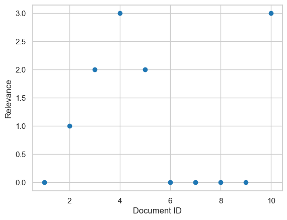
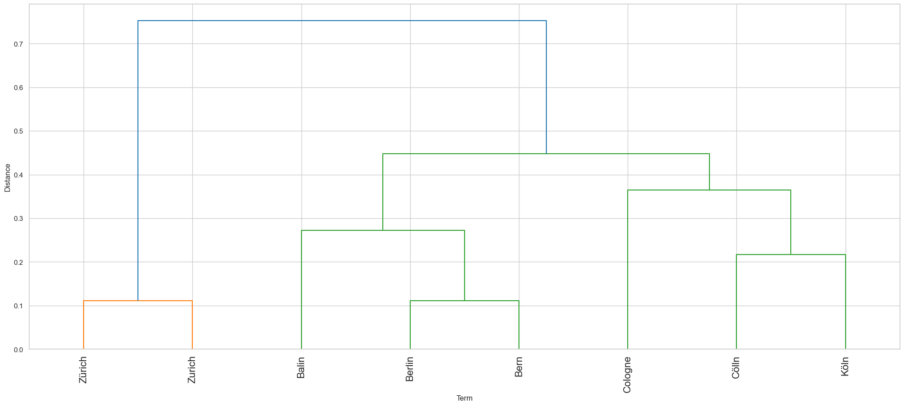
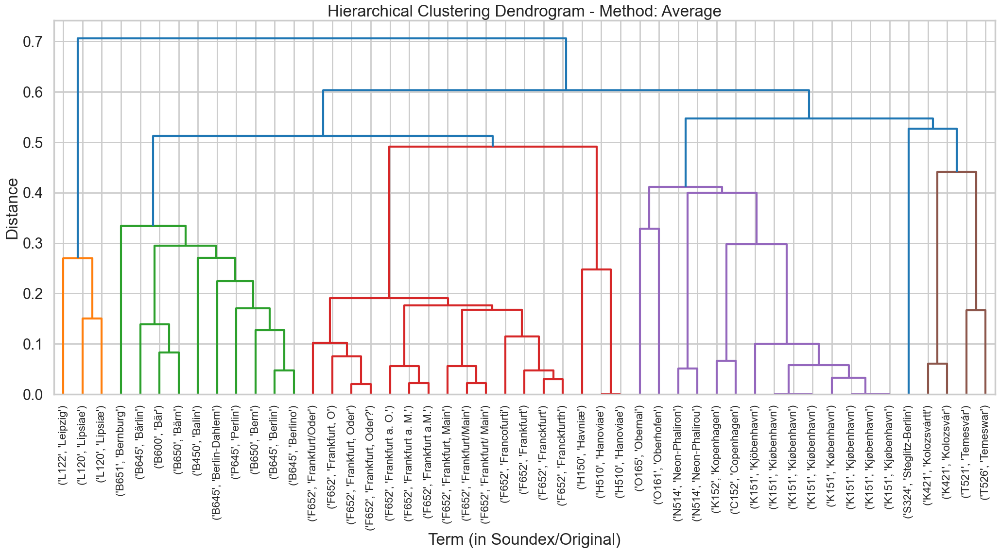
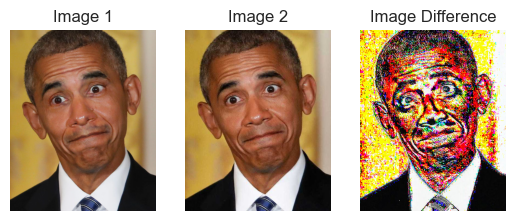
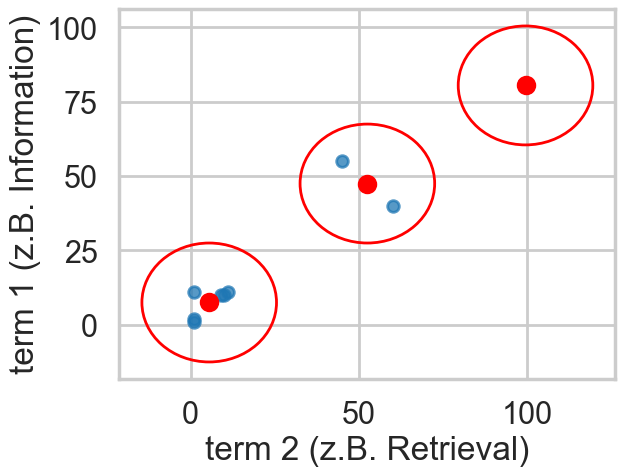
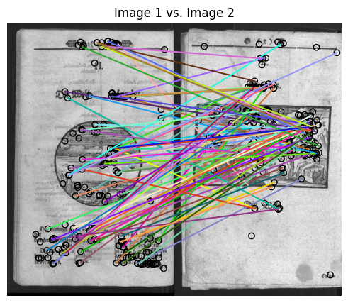
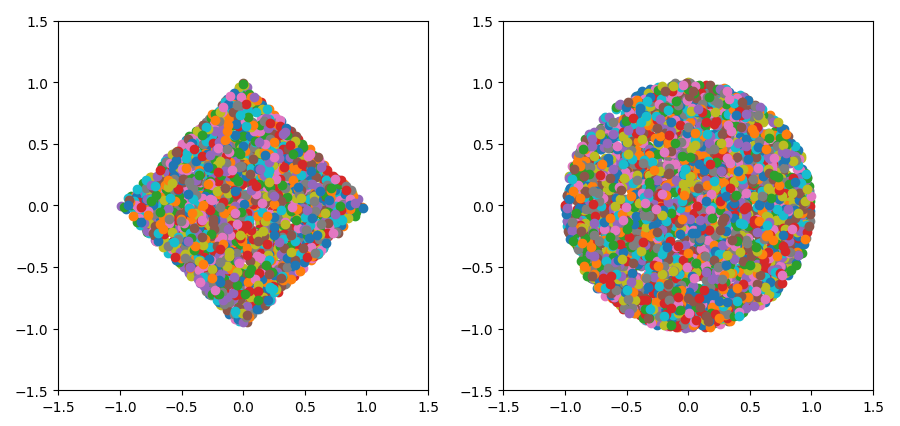

# courses

Various courses and teaching materials created from 2016 on...

## Spring Clean-Up 2026

All materials have been categorized as follows:

### Data Management

- [Basic_EvaluationMetrics.ipynb](data_management/Basic_EvaluationMetrics.ipynb) explains various evaluation metrics
  commonly used in information retrieval ( Precision, Recall and F-Score, nDCG)
  

$$
Precision=\frac{|tp|}{|tp|+|fp|}\equiv\frac{|\mbox{relevant elements in result}|}{|\mbox{elements in result}|},
$$
$$
Recall=\frac{|tp|}{|tp|+|fn|}\equiv\frac{|\mbox{relevant elements in result}|}{|\mbox{relevant elements in collection}|}\mbox{, and}
$$

- [clustering_and_dendrograms.ipynb](data_management/clustering_and_dendrograms.ipynb) explains agglomerative clustering
  with the help of city names. Additionally, the sample compares a simple string-based approach with a linguistic-based
  method (_Metaphone_). Similarity calculation is based on Jaro-Winkler and dendrograms (see below).
  
- [clustering_agglom_methods_linguistics.ipynb](data_management/clustering_agglom_methods_linguistics.ipynb) buils on the
  previous tutorial based on city names. This notebook compares various agglomerative clustering approaches
  and methods such as _Metaphone_ and _SOUNDEX_.
- 

### AI Risks

- [ImageSubtract.ipynb](hwr_ai_risks/ImageSubtract.ipynb) illustrates how AI-based image recognition can be disturbed,
  while staying unnoticeable for humans.
  

### Information Retrieval

- [InformationRetrieval.ipynb](information_retrieval/InformationRetrieval.ipynb) **(Only available in German)** explains
  basic IR principles such as the _cluster hypothesis_, _Zipf's law_, _tf\*idf_ etc. while referencing the relevant literature.

- [ImageSimilarity_and_ClusterDemo.ipynb](information_retrieval/ImageSimilarity_and_ClusterDemo.ipynb) introduces a typical
  content-based image retrieval (CBIR) workflow. You will learn to extract some image features, determine similar images
  based on different measures. To compare the different approaches, HTML reports will be generated. These reports are
  available precomputed: see [this document for the ORB feature](https://8bit-inferno.de/fhp/_orb.html) or [a histogram-based approach](https://8bit-inferno.de/fhp/_main.html).
  

### Mathematical Foundations

- [UnitBall.ipynb](math/UnitBall.ipynb) visualizes the unit "circles" for different _p_-norms.
  

### Slides

[slides/](slides/) contains slides about varying topics.

### Broken Notebooks

Broken notebooks have been moved to a [separate folder](broken_notebooks/).
